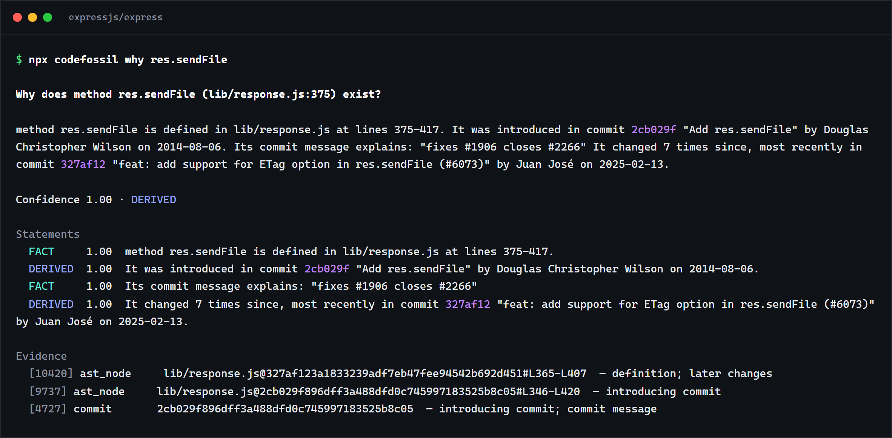
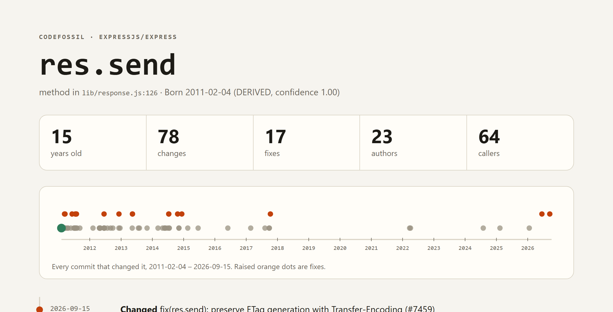
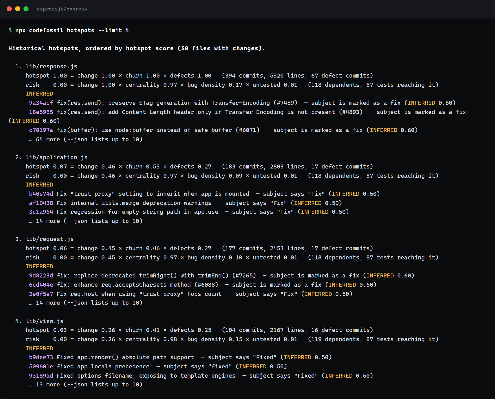
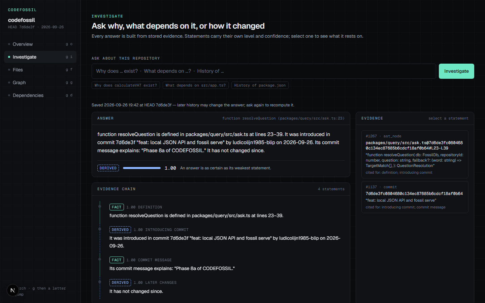

# CODEFOSSIL

**Ask your Git history why code exists. Every answer comes with its evidence.**

[](https://github.com/ludicolijn1985-blip/codefossil/actions/workflows/ci.yml)
[](https://www.npmjs.com/package/codefossil)
[](LICENSE)


`git blame` tells you who touched a line last. CODEFOSSIL tells you **where a function came from,
what changed it, which issue or pull request explains it, what depends on it, and where your
history keeps breaking**. Each statement is labelled as observed, computed or inferred, with
confidence and a pointer to the commit, issue or line it rests on.



## Try it in 30 seconds

```bash
cd any-git-repository
npx codefossil why <function-or-file>
```

The first question indexes the history into `.codefossil/` (it ignores itself; your repository is
untouched). Express, 6,170 commits over 15 years, takes about 20 seconds. Later questions only
add new commits. No account, no upload, no AI needed.

Some repositories (Express among them) set `ignore-scripts=true` in their `.npmrc`, which stops
npm from installing the SQLite driver's binary. There, run
`npx --ignore-scripts=false codefossil …`, or `npm install -g codefossil` once.

## What you can ask

| Command                                 | Answers                                                                           |
| --------------------------------------- | --------------------------------------------------------------------------------- |
| `codefossil why res.sendFile`           | Where it was introduced, by whom, why (commit, issue, PR), how it changed since   |
| `codefossil impact res.json`            | Which functions call it, which files import it, transitively, and which are tests |
| `codefossil timeline lib/response.js`   | Every change to a file, across renames, with the symbols and PRs behind it        |
| `codefossil hotspots`                   | Where history concentrates: change × churn × fix commits, with risk components    |
| `codefossil dead-intent`                | Workarounds whose reason may be gone ("temporary", "compat", old Node versions)   |
| `codefossil fossils`                    | The oldest code still running, when it was born and what happened to it since     |
| `codefossil why res.send --html x.html` | A one-page, shareable history of a function: birth, moves, every change, fixes    |
| `codefossil query "what depends on X?"` | The same answers from a plain-words question                                      |
| `codefossil report --base origin/main`  | A Markdown report on everything a branch touches, for CI and pull requests        |
| `codefossil serve` + web UI             | Browse investigations, the evidence graph, hotspots and dependencies              |
| `codefossil mcp`                        | The same answers for AI coding agents (Claude Code, Cursor, VS Code)              |

Targets can be a symbol (`res.sendFile`, `Cart.total`), a path, `path:Symbol`, a commit sha,
`#123` or `npm:package`. An ambiguous target lists the candidates instead of guessing.

## Give your AI coding agent the history it is missing

Agents read the code as it is today. They do not know that the odd `if` was the fix for a
production incident, or that a "dead" function is still imported by tests. `codefossil mcp` lets
Claude Code, Cursor, VS Code and any other MCP client ask before they change something:

```bash
claude mcp add codefossil -- npx -y codefossil mcp
```

Cursor, in `.cursor/mcp.json` (VS Code: `.vscode/mcp.json`, with `"servers"` instead of
`"mcpServers"` and `"type": "stdio"` added):

```json
{
  "mcpServers": {
    "codefossil": {
      "command": "npx",
      "args": ["-y", "codefossil", "mcp", "--repo", "${workspaceFolder}"]
    }
  }
}
```

The agent gets nine read-only tools: `why`, `impact`, `timeline`, `symbols`, `hotspots`,
`dead_intent`, `fossils`, `lens` and `change_report` (what a branch's commits touch). They run
offline on your machine. Answers carry the same evidence and FACT/DERIVED/INFERRED labels as the
CLI, so the agent can tell what is known from what is guessed.

## Share a function's life story

```bash
codefossil why res.send --html res-send.html
```

One self-contained page, with no scripts or external files: when the function was born (followed
back through moves), every commit that changed it on a timeline, which of them were fixes, the
issues behind them and how many places call it.



## Evidence, not guesses

Every relationship CODEFOSSIL stores has a provenance: what produced it, how, and which evidence
supports it. Answers are built from statements that carry their own level:

- **FACT**: observed directly (this commit exists, this function is defined on these lines).
- **DERIVED**: computed deterministically from facts (this commit introduced the function).
- **INFERRED**: a heuristic reading, never certain (this commit looks like a bug fix).

An answer is never more certain than its weakest statement, and gaps are stated as gaps.



## Why not `git blame`, `git log -S` or an AI assistant?

- **`git blame`** shows the last change to a line. Refactors and moves bury the origin.
  CODEFOSSIL follows symbols and files across renames back to where they were introduced.
- **`git log`** gives you commits. CODEFOSSIL links them to the functions they changed, the
  issues and pull requests that explain them, and the files that depend on the result.
- **AI assistants** give fluent answers without saying what they rest on. CODEFOSSIL works
  without AI. Its optional AI layer (Ollama locally or Anthropic) may only answer from the
  evidence it is shown, every claim must cite it, and claims that cite anything else are dropped.

## Pull requests: know what broke here before

```yaml
on: pull_request
permissions: { contents: read, issues: read, pull-requests: write }
jobs:
  codefossil:
    runs-on: ubuntu-latest
    steps:
      - uses: actions/checkout@3d3c42e5aac5ba805825da76410c181273ba90b1 # v7.0.1
        with: { fetch-depth: 0 }
      - uses: ludicolijn1985-blip/codefossil@main
        with: { comment: 'true' }
```

The pull request gets one comment, updated on every push, that leads with the functions it
changes that earlier fixes changed too:

> ⚠️ `res.send` (method) in `lib/response.js:126`: **17 earlier fixes** among 79 earlier changes
> (INFERRED) · 118 files depend on its file

Below that come every changed file's history, hotspot and risk scores and dependents, with the
repository's hotspots and dead-intent candidates folded away. The index is cached, so each run only
adds new commits. Without `comment` the report goes to the job summary. See [ACTION.md](ACTION.md).

## GitHub issues and pull requests as evidence

```bash
codefossil connect github   # token from GITHUB_TOKEN, GH_TOKEN or `gh auth login`; never stored
codefossil index            # syncs issues, pull requests and reviews incrementally
```

Now `why` can say "introduced by PR #412, which resolves issue #398", and hotspots count issues
labelled as bugs instead of relying on commit wording.

## In your editor

The VS Code extension in [`apps/vscode`](apps/vscode) shows one line of history above every
function, class and method — `born 2011 · 78 changes · 17 fixes · 64 callers` — with the
birth commit and latest change on hover. It talks to one local `codefossil mcp` process per
workspace, so nothing leaves your machine. Any editor can do the same with
`codefossil lens <file> --json`.

## Web UI



`codefossil serve` starts a local, loopback-only JSON API ([API.md](API.md)). The Next.js UI in
`apps/web` runs from a checkout of this repository: `pnpm install && pnpm build`, then
`pnpm --filter @codefossil/web start`.

## Optional AI layer

```bash
codefossil ai configure --provider ollama                    # runs on this machine
codefossil ai configure --provider anthropic --allow-cloud   # evidence leaves this machine
codefossil ask "Why did we keep the legacy invoice path?"
```

AI is off by default. Evidence is gathered deterministically first. Source code is withheld
unless you allow it, and every AI claim is INFERRED and capped at confidence 0.6. See
[SECURITY.md](SECURITY.md).

## Local-first and safe on untrusted repositories

- **Local.** Everything runs on your machine: no telemetry, no upload.
- **No code execution.** Repository content is parsed, never executed; git runs with argument
  arrays, never a shell.
- **Tokens.** Tokens are read from the environment at use and never stored.
- **Loopback API.** The API listens on loopback only, with Host-header and CSRF protection.

## Languages

Symbols, calls and imports: **TypeScript, JavaScript (ES modules, CommonJS, prototype style and
IIFE/UMD wrappers), Python, Go, Rust, Java, C#, Ruby and PHP**, parsed with Tree-sitter. C#
`using` directives name namespaces, which are not tied to files, so they stay unresolved. History, hotspots and timelines work for any file in any
language. Manifests: `package.json`, `go.mod`, `Cargo.toml`, `pyproject.toml`, `requirements*.txt`.

More languages are a great first contribution; see [CONTRIBUTING.md](CONTRIBUTING.md).

## Documentation

- [CLI.md](CLI.md): every command.
- [API.md](API.md): the local JSON API.
- [ARCHITECTURE.md](ARCHITECTURE.md): the evidence model and every algorithm.
- [SCHEMA.md](SCHEMA.md): the database.
- [ACTION.md](ACTION.md): the GitHub Action.
- [SECURITY.md](SECURITY.md): the threat model and guarantees.

## Known limitations

- **Static calls only.** `impact` lists callers from calls resolved at HEAD where one definition
  fits: the method's own class, the definition an import binds, one in the calling file, or a
  unique qualified name (INFERRED). Calls through variables, callbacks and dynamic dispatch are not
  seen, and files are still counted when they import the defining file.
- **Inferred defects.** Without GitHub, defect commits come from reverts and fix wording in
  subjects (INFERRED). Test reach is import reach, not line coverage.
- **HEAD only.** Only history reachable from HEAD is indexed. When HEAD leaves the indexed
  history (a reset, rebase or force-push, a deleted branch, an older checkout, or a CI cache
  restored from another branch), the next index run removes the commits HEAD no longer contains,
  with the symbols, relations and evidence derived from them, re-parses the history of the files
  they touched and rebuilds the dependency graph at HEAD; GitHub data and saved investigations are
  kept. Returning to a branch indexes its commits again, so switching far apart (an old tag and
  back) costs about as much as indexing that history anew. In a shallow clone, indexed commits the
  clone does not have are kept, since they cannot be told apart from older history: index CI runs
  with `fetch-depth: 0`. With automatic indexing off (`CODEFOSSIL_AUTO_INDEX=0`), `status`,
  `doctor`, the report, the API status and the web UI say so instead.
- **Wrapped modules.** Definitions inside a module-level wrapper (an IIFE, `.call(this)` or a UMD
  factory) count as module level; definitions inside other functions or callbacks are local and are
  not symbols.
- **Symbol identity.** A symbol is identified by kind and qualified name within a file. Code
  copied or moved to another file with identical content (three lines or more) is followed back to
  its original; a renamed symbol, or one edited while it moved, looks like a new one.
- **Unresolved imports.** Import resolution leaves unresolved, and says why, what it cannot
  decide from files and manifests. Python import names that differ from their distribution are
  matched only for a curated list of well-known packages (`yaml` → PyYAML); Go `replace` directives
  are followed to directories inside the repository. TypeScript `paths` and `baseUrl` come from the
  nearest `tsconfig.json`/`jsconfig.json` (`extends` followed within the repository only).
- **GitHub links.** Closing keywords (`Fixes #12`) are DERIVED at confidence 0.9, and only
  same-repository references are linked.

## License

MIT. The npm package bundles Tree-sitter grammars under their own MIT licenses, listed in its
`THIRD_PARTY_NOTICES.md`.
